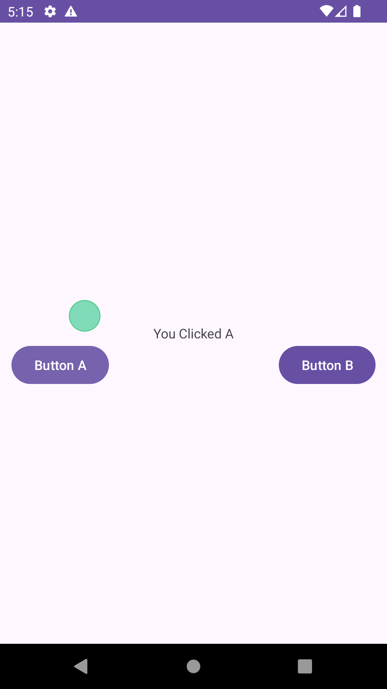

# Android Pointer


Demo project that shows how to add a Pointer / Cursor layout to Android. 

The cursor will move when the keyboard keys are pressed and will send a click event when Enter is clicked.




### How to use

Copy the package `com.zygne.androidpointer.pointer` to your project and the PointerLayout as a parent to your view

```
<?xml version="1.0" encoding="utf-8"?>
<com.zygne.androidpointer.pointer.PointerLayout xmlns:android="http://schemas.android.com/apk/res/android"
    android:id="@+id/pointerLayout"
    xmlns:app="http://schemas.android.com/apk/res-auto"
    xmlns:tools="http://schemas.android.com/tools"
    android:layout_width="match_parent"
    android:layout_height="match_parent">

    <androidx.constraintlayout.widget.ConstraintLayout
        android:id="@+id/main"
        android:layout_width="match_parent"
        android:layout_height="match_parent"
        android:padding="12dp"
        tools:context=".MainActivity">

        ......

    </androidx.constraintlayout.widget.ConstraintLayout>
</com.zygne.androidpointer.pointer.PointerLayout>
```

create a implementation of the class `com.zygne.androidpointer.pointer.Content`

```
internal class Content(private val view: View) : com.zygne.androidpointer.pointer.Content {
        override fun scrollTo(x: Int, y: Int) {
            view.scrollTo(x, y)
        }

        override val scrollX: Int
            get() = view.scrollX

        override val scrollY: Int
            get() = view.scrollY

        override fun canScrollVertically(direction: Int): Boolean {
            return view.canScrollVertically(direction)
        }

        override fun canScrollHorizontally(direction: Int): Boolean {
            return view.canScrollHorizontally(direction)
        }

        override fun onMouseVisibilityChanged(visible: Boolean) {
        }

    }
```

and set the implementation as the `Content` for the `PointerLayout`

```
   override fun onCreate(savedInstanceState: Bundle?) {
        super.onCreate(savedInstanceState)
        setContentView(R.layout.activity_main)
   
        // .....
        
        val content = Content(view)
        pointerLayout.setContent(content)
    }
```